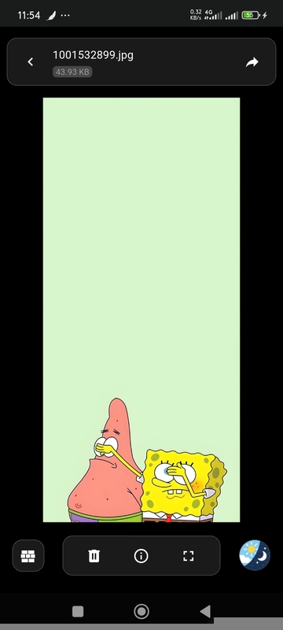
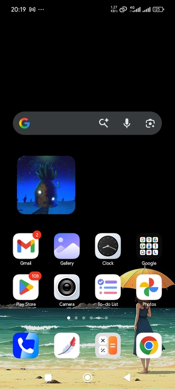
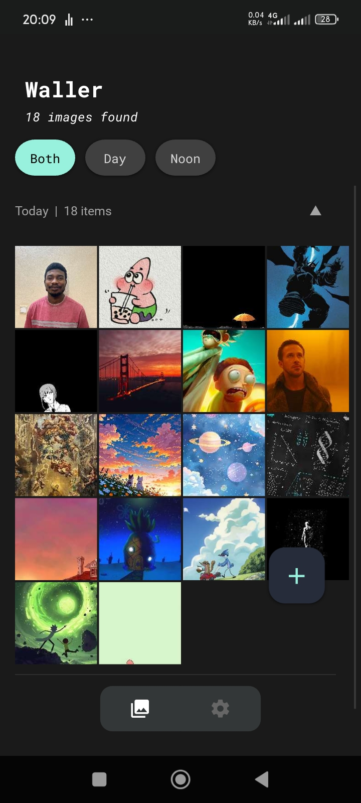

Wally: A working Android wallpaper carousel with no ads.

[APK Download](https://github.com/Fector101/wallpaper-carousel/actions/runs/21377987773/artifacts/5264905705)

- Every 2mins wallpaper switches to a new image already provided by user.

## More Features

### Home screen widget
- To view Lock-screen image from home screen
- Can Tap to Enter App

### Notification
- Large Icon to Preview Next image
- Skip Button to change upcoming Image
- Stop Button to End carousel 

### Permissions
- Access to Only Images.
- Notifications for more user controls and preview

### Help
- Saving added images in app path only
- Added export button to get images if uninstalling app

## Few Screen Samples

| **View Screen Design** | **Home Screen Widget** |
|-------------------------------------|--------------------------------------------------------|
| |  |

---

| **Gallery Screen Design** | **Preview Screen Design** |
|-------------------------------------|--------------------------------------------------------|
| |  |

---

