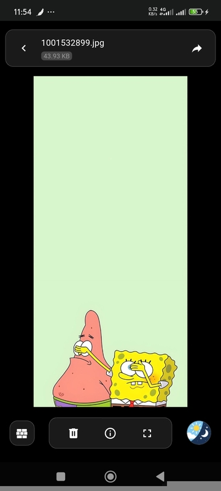
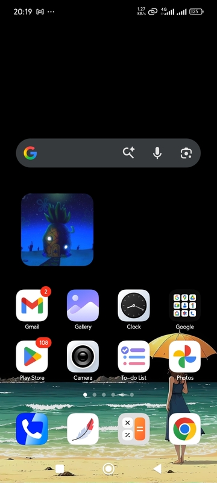
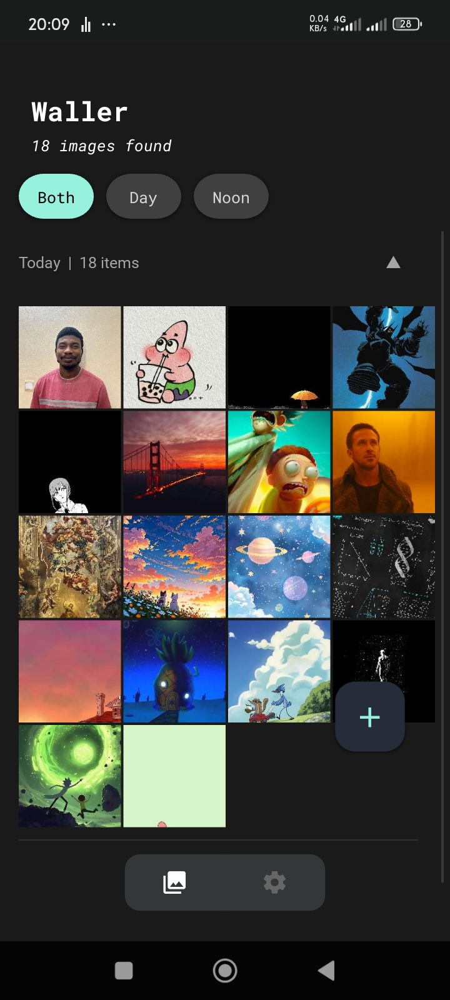
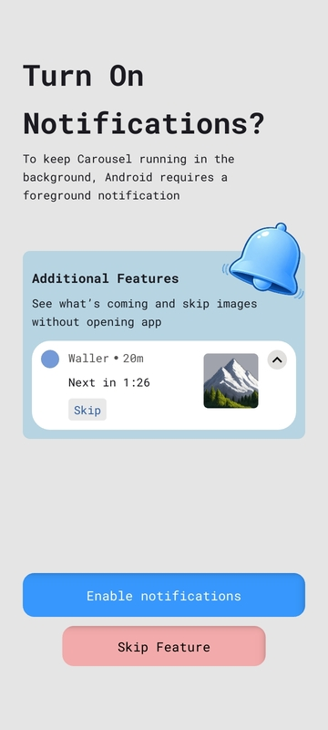
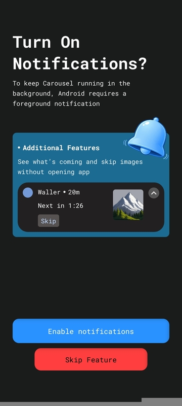

Wally: A working Android wallpaper carousel with no ads.

[APK Download](https://github.com/Fector101/wallpaper-carousel/releases/download/v1.0.5/waller.apk)

- The wallpaper automatically switches to a new user-selected image every 2 minutes (or at a custom interval set by the user). Users can also choose changes to happen on screen wakes.

## More Features

### Home screen widget
- To view Lock-screen image from home screen
- Can Tap to Enter App

### Notification
- Large Icon to Preview Next image
- Skip Button to change upcoming Image
- Stop Button to End carousel 

### Permissions
- Access to Only Images.
- Notifications for more user controls and preview

### Help
- Saving added images in app path only
- Added export button to get images if uninstalling app
- A Button to Share Images to other Apps
- App is set to Auto detect android Theme (Dark Theme Recommended 😅)

## Few Screen Samples

| **View Screen Design** | **Home Screen Widget** |
|-------------------------------------|--------------------------------------------------------|
| |  |

---

| **Gallery Screen Design** | **Preview Screen Design** |
|-------------------------------------|--------------------------------------------------------|
| |  |

---

| **Request Screen Design** | **Request Screen Dark Mode** |
|-------------------------------------|--------------------------------------------------------|
| |  | 

---
