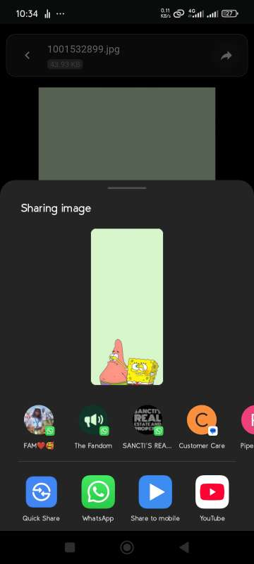
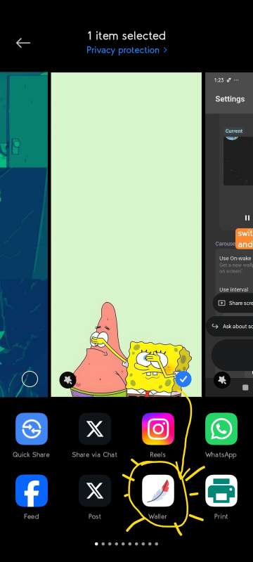

# Waller

**A simple, ad-free Android wallpaper carousel.**

**[Download APK](https://github.com/Fector101/wallpaper-carousel/releases/download/v1.0.8/waller.apk)**

---

## Overview

Wally automatically rotates your wallpapers using images you choose.

* Change wallpapers every **2 minutes** (or any custom interval)
* Option to update wallpapers on **screen wake**
* Fully **offline** and **ad-free**

---

## Features

### Wallpaper Carousel

* Automatically cycles through selected images
* Custom time intervals
* Optional change on screen wake

### Home Screen Widget

* View current lock-screen wallpaper from your home screen
* Tap the widget to quickly open the app

### Notification Controls

* Preview the next wallpaper (large icon)
* Skip to the next image
* Stop the carousel anytime

### Image Import & Sharing

* Share images directly to Wally from other apps
* Easily share images from Wally to other apps

---

## Permissions

* Images only — no unnecessary access
* Notifications — for controls and previews

---

## Help & Notes

* Images are stored inside the app’s internal directory
* Use the Export feature before uninstalling to keep your images
* Automatically adapts to system theme (dark mode recommended)

---

## Screenshots

*All screenshots are low resolution for faster loading*

### Main Screens

| View Screen                                                      | Home Screen Widget                                       |
| ---------------------------------------------------------------- | -------------------------------------------------------- |
|  |  |

---

### Gallery & Preview

| Gallery Screen                                         | Preview Screen                                      |
| ------------------------------------------------------ | --------------------------------------------------- |
|  |  |

---

### Request Screens

| Light Mode                                             | Dark Mode                                                  |
| ------------------------------------------------------ | ---------------------------------------------------------- |
|  |  |

---

### Image Share Features

| Share To other apps                                             | Share From other Apps                                               |
| ------------------------------------------------------ | ---------------------------------------------------------- |
|  |  |

---

## Why Waller?

* No ads
* No tracking
* Clean, focused wallpaper experience

---
